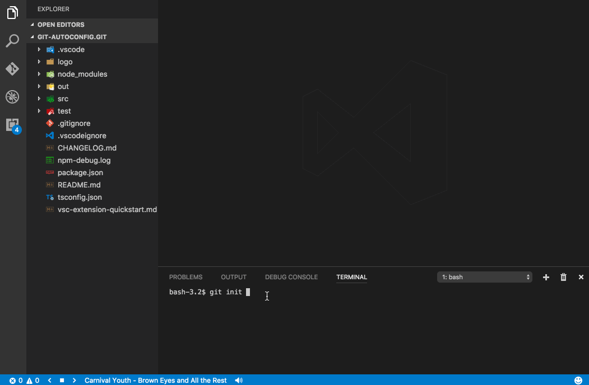

# git-autoconfig

Working with git repos where you can have multiple emails (like one for work, one for github, one for bitbucket, etc...) can be painful. This extension forces you to set locally user.email and user.name for each project under git that you open with vscode.

## Features

* Convenient selector of previous used pairs of user.email and user.name.

## Extension Settings

This extension contributes the following settings:

* `git-autoconfig.queryInterval`: Interval for querying of git config in ms
* `git-autoconfig.configList`: List of local git configs in format [{'user.email': 'Marvolo@Riddle.Tom', 'user.name': 'Tom Marvolo Riddle'}] . Extension itself writes into this setting too.

## Release Notes

### 0.0.2 2020-09-13
- Feature: Add option to not auto add config [3](https://github.com/ShyykoSerhiy/git-autoconfig/issues/3)

### 0.0.1 2017-04-04

Initial release of git-autoconfig
